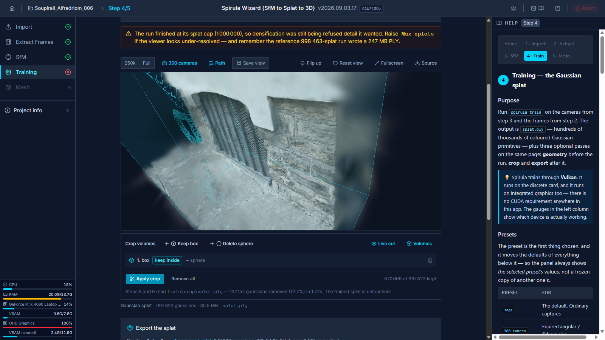
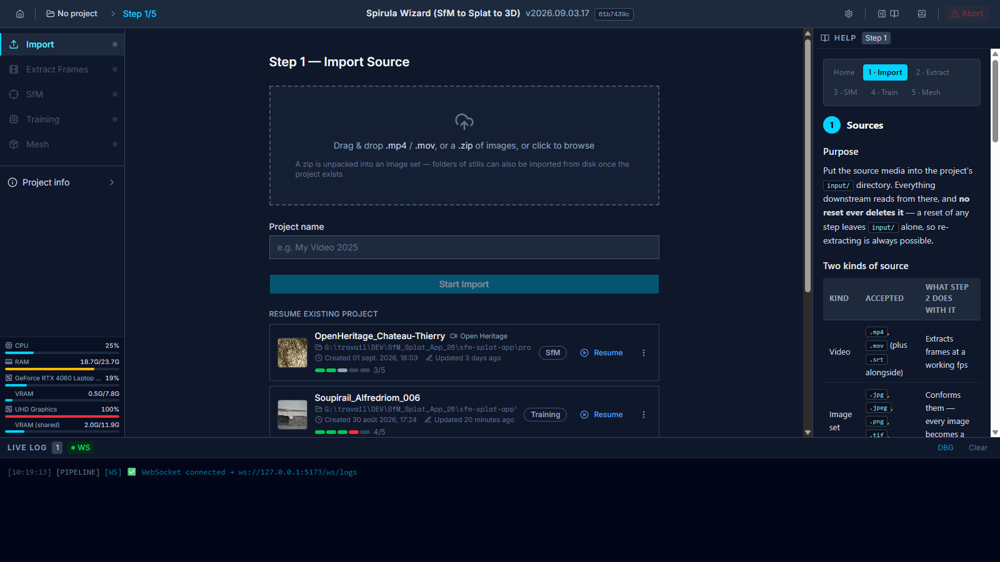
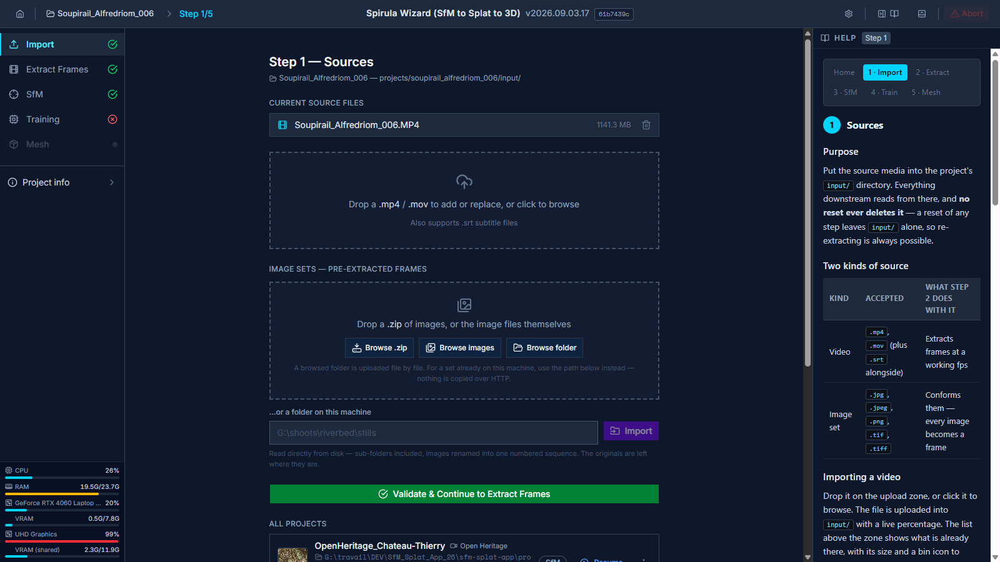
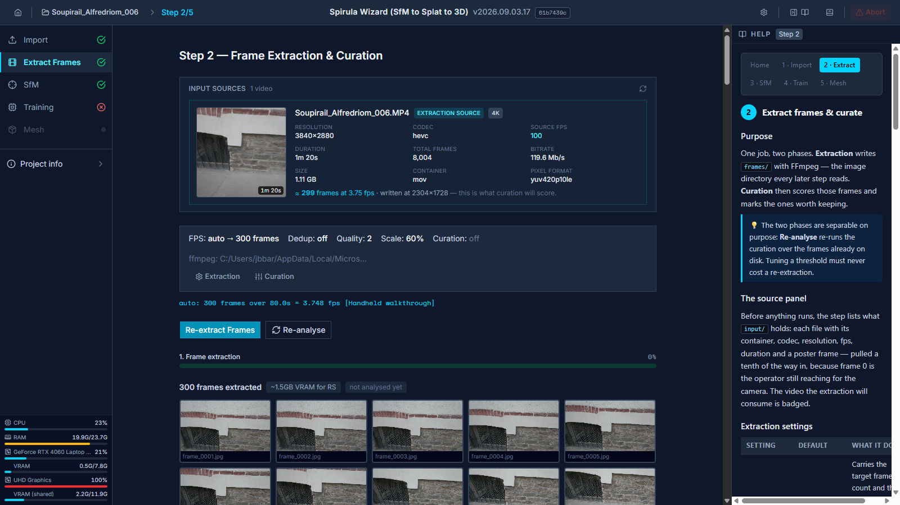
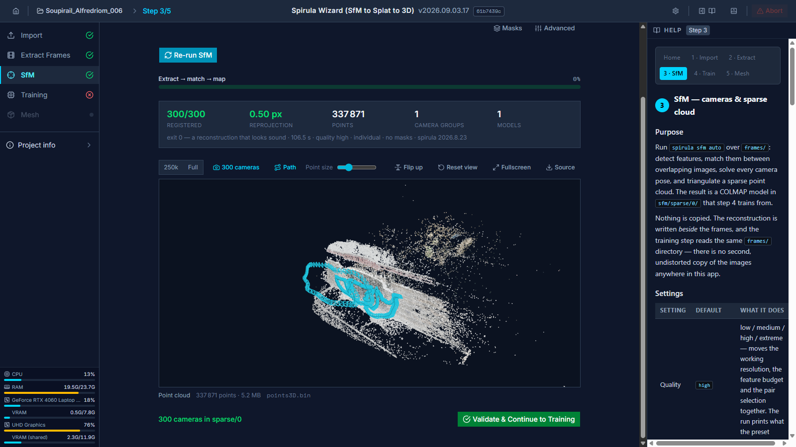
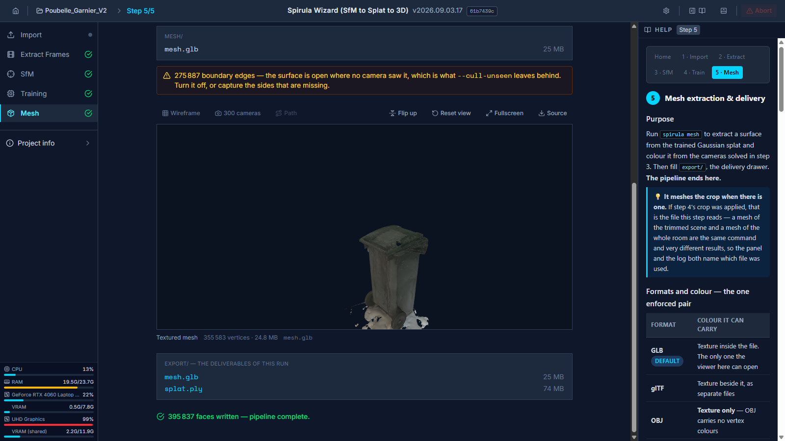
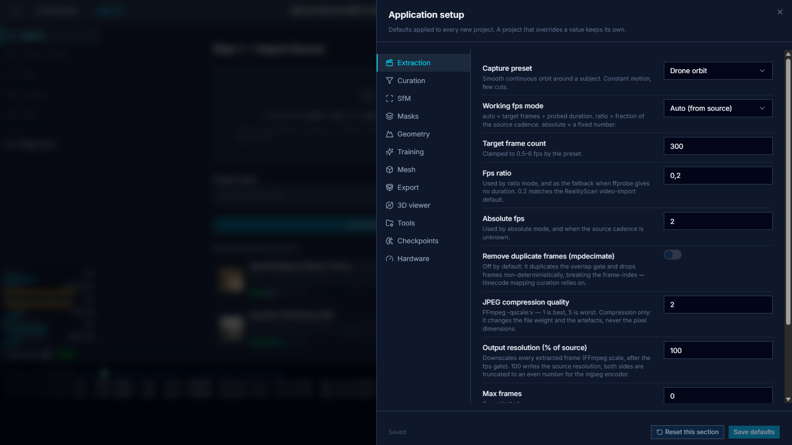
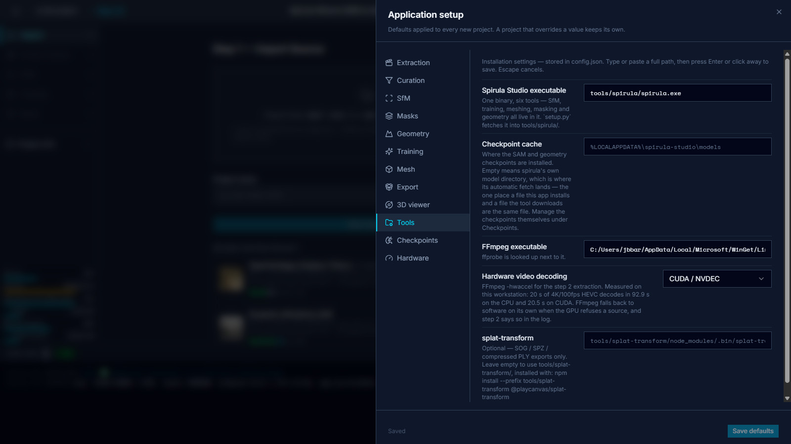
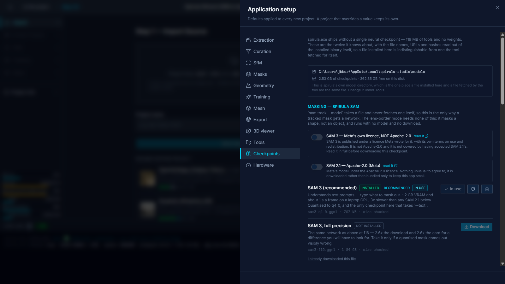
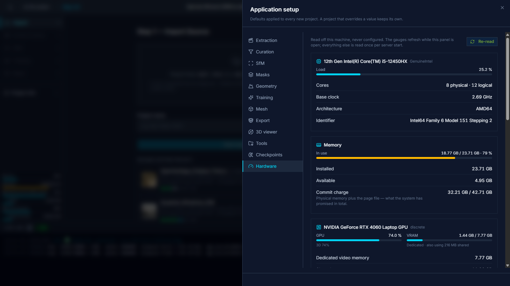

# SfM Splat App

**A local-first web app that drives a full video → 3D Gaussian Splat → mesh pipeline on one external binary plus FFmpeg — and needs no CUDA anywhere.**




---

## What it is

A five-step wizard (React) driving a FastAPI backend that orchestrates local binaries as
subprocesses. You give it a video or a folder of stills; it gives you a Gaussian splat, a
textured mesh, and a drawer of deliverables.

```
video / images ─> [2] extract + curate ─> [3] SfM ─> [4] train ─> [5] mesh + export
                      FFmpeg (ours)        spirula    spirula      spirula
```

The single reconstruction tool is **[Spirula Studio](https://github.com/harry7557558/spirula-studio)**
(`spirula.exe`, GPL-3.0) — one 119 MB binary carrying six tools: `sfm`, `train`, `mesh`,
`sam`, `geometry`, `gui`. FFmpeg does everything before step 3.

**It is Vulkan, not CUDA, and that is the whole point.** The shipped binary imports
`vulkan-1.dll` and no CUDA library. On the development workstation `spirula sam devices`
enumerates and *accepts* both GPUs:

```
idx name                                       type        vram      status
0   Intel(R) UHD Graphics 770                  integrated    11.9 G  ok
1   NVIDIA GeForce RTX 4060 Laptop GPU         discrete       7.8 G  ok
```

The integrated Intel part is not merely listed — it passes the tool's own baseline
(Vulkan 1.2 core with `bufferDeviceAddress` and `timelineSemaphore`). So this app runs on
NVIDIA, AMD, Intel and Apple silicon.

**360° / fisheye capture is a first-class input**, not an afterthought: spirula reads
equirectangular and >180° fisheye natively, with no undistortion pass anywhere in the
pipeline.

### What it does that a shell script would not

- **Nothing is simulated.** Every step calls the real tool. A missing or misconfigured
  binary fails the step with the path it looked for.
- **Every run is a record on disk.** Close the page, reload it, even kill the backend —
  the run is found again and finished. A training run hard-killed at 31 % kept working
  with no backend in existence, was re-attached by the next one, and wrote a complete
  result file.
- **Every job is cancellable**, and abort kills the tool's whole process tree.
- **Re-running a phase never costs the phase before it.** Curation, masking, geometry,
  crop and export are each re-runnable alone: tuning a threshold must never cost a
  re-extraction or a 16-minute training run.
- **The 3D viewer looks, it never writes.** Sparse cloud, trained splat and textured mesh
  each get a renderer; the crop tool places its volumes in the viewer, but a backend pass
  makes the cut, and it writes a *second* file beside the trained splat.

---

## Origin and context

This project is part of a broader effort to simplify the 3D Gaussian Splatting (3DGS)
creation workflow.

In parallel, I am building an online service that generates professional-grade 3D content
for various industries. This application is meant to be the production tool behind that
service: a fast and reliable way to generate splats without juggling a fragmented
toolchain.

After evaluating several options, I settled on
**[Spirula Studio](https://github.com/harry7557558/spirula-studio)**, a Vulkan-based engine
that can train and render Gaussian Splats on any GPU, with no hard dependency on NVIDIA
hardware.

**SfM_Splat_App_26 is first and foremost a new interface (UX) on top of Spirula Studio**,
following on from the `3DGS_App_26` project. It adds no reconstruction or training
algorithm of its own: all generation relies on Spirula Studio's native features.

What this repository *does* contribute is everything around that engine — frame extraction
and curation, the project and run lifecycle, the progress channels, the 3D viewer, the
crop and export passes, and the setup that keeps a fragmented toolchain from being
something you have to hold in your head.

The predecessor, `3DGS_App_26`, needed an NVIDIA GPU in two independent places —
RealityScan to mesh, LichtFeld Studio to exist at all. Replacing both with one Vulkan
binary is what made this rewrite worth doing.

---

## The pipeline, step by step

Screenshots below are real runs on this workstation — a 1 m 20 s 4K/100 fps HEVC rush,
300 frames.

### Landing — the project list

Every project is a directory under `projects/` and a row in SQLite. Copy, reset, archive
and delete are on each tile; `input/` is never a casualty of a reset.



### Step 1 — Sources

Put the source media into the project's `input/`. Three doors for an image set, because
they are three different costs: a **folder path** read server-side (a 20 GB set is a local
copy, never an upload), a **zip**, or a **file selection** for when you are working from
another machine on the LAN.



### Step 2 — Extract & curate frames

One job, two phases. FFmpeg writes `frames/` — the image directory every later step reads
— and curation then scores those frames and marks the ones worth keeping.

- Working fps by policy: `auto` (a target frame count over the duration), `ratio` (a
  fraction of source fps), or an absolute value. An fps too low to place one frame in the
  source is refused *before* anything is deleted.
- Hardware decoding is an installation setting. Measured on 20 s of 4K/100 fps 10-bit
  HEVC: the real extraction shape went **95.5 s → 17.9 s**.
- Cut detection rides along with the extraction rather than decoding the video a second
  time. End to end on a 20 s clip, step 2 went from **220 s to 26 s**.
- Curation is relative, never an absolute blur threshold: sharpness against a rolling
  median, plus an ORB feature-displacement overlap gate per sequence.



### Step 3 — Structure from Motion

`spirula sfm auto` over `frames/`: detect features, match them, solve every camera pose,
triangulate a sparse cloud into a COLMAP model at `sfm/sparse/0`.

**Nothing is copied.** The reconstruction is written *beside* the frames and step 4 trains
on the same `frames/` directory — there is no second, undistorted copy of the images
anywhere in this app. On the project measured that is 226 MB not written twice, and on a
4K project it is tens of gigabytes.

The viewer draws the sparse cloud with the solved camera path over it, each frustum at the
lens the reconstruction actually solved.



### Step 4 — Gaussian splat training

`spirula train` on the cameras from step 3 and the frames from step 2. Seven presets, and
the panel always shows the *selected* preset's values rather than a frozen copy of
another's.

Three optional passes live on the same page:

| Pass | What it does | Re-runnable alone |
|---|---|---|
| **Geometry** | per-image depth / normal maps feeding the trainer's geometry terms | yes |
| **Crop** | box and sphere volumes placed in the viewer, cut server-side into `train/crop/splat.ply` — *beside* the trained splat, never over it | yes |
| **Export** | a deliverable copy in five formats (`ply`, `splat`, `sog`, `spz`, `compressed-ply`), with optional SH reduction, opacity floor and target count | yes |

The crop is undone by deleting one directory, and a re-crop starts from the trained splat
— so dragging a volume back out restores what it excluded.


### Step 5 — Surface mesh & delivery

`spirula mesh` extracts a surface from the trained splat and colours it from the cameras
solved in step 3, then fills `export/` — the delivery drawer — with hard links to the
splat it meshed and the mesh it wrote. The pipeline ends here.

> The step-5 screenshot below is from a different project (`Poubelle_Garnier_V2`), which
> had a finished mesh when the shots were taken.



---

## Prerequisites

| Requirement | Notes |
|---|---|
| **Windows 10/11 x64** | Windows-first. `start.sh` exists but the app is developed and measured on Windows. |
| **A Vulkan 1.2 GPU** | With `bufferDeviceAddress` and `timelineSemaphore`. Integrated graphics qualify — check with `spirula sam devices`. **No CUDA required.** |
| **Python 3.11+** | Developed on 3.12. |
| **Node.js 18+** | For the frontend dev server (and, optionally, `splat-transform`). |
| **FFmpeg + ffprobe** | System executables, called as subprocesses. [gyan.dev builds](https://www.gyan.dev/ffmpeg/builds/) or `winget install ffmpeg`. |
| **VC++ 2015-2022 redistributable** | The only runtime `spirula.exe` needs. No Vulkan SDK — that is a *build* dependency, and `vulkan-1.dll` ships with every modern GPU driver. |
| **Disk** | The SfM workspace alone is ~200 MB per 300 images, and a trained `splat.ply` is 150–250 MB. |

Optional:

| Optional | For |
|---|---|
| **`@playcanvas/splat-transform`** (npm) | The three compressed export formats (SOG, SPZ, compressed PLY). PLY and `.splat` exports need nothing at all. |
| **A SAM or MoGe/Metric3D checkpoint** | Only for `sam track` masking and the `geometry` pass. `sfm`, `train`, `mesh` and `sam mask` need none — a first run should not be blocked on a download it may never use. Installed from **Setup → Checkpoints** inside the app. |

---

## Installation

```powershell
git clone https://github.com/baronstudio/SfM_Splat_App_26
cd SfM_Splat_App_26\sfm-splat-app
```

### 1. Backend

```powershell
py -3.12 -m venv .venv
.\.venv\Scripts\python.exe -m pip install -r requirements.txt
```

### 2. Frontend

```powershell
cd frontend
npm install
cd ..
```

### 3. Spirula Studio

`tools/` is gitignored — `spirula.exe` is 119 MB, over GitHub's hard 100 MB per-file
limit. Download the Windows Vulkan build from the
[spirula-studio releases](https://github.com/harry7557558/spirula-studio/releases) and
unzip the single `spirula.exe` it contains into `tools/spirula/`:

```
sfm-splat-app/tools/spirula/spirula.exe
```

The build this app is measured against is `spirula-2026.8.23-windows-vulkan-x86_64.zip`
(36 327 606 bytes, sha256 `682f2602622a155f1dc529c224e2da544274dbfa27cc141a2363370d85002125`),
containing exactly one file of 119 462 912 bytes. No build from source is needed.

### 4. `config.json`

Create `sfm-splat-app/config.json` (or set the paths from the app's **Setup → Tools**
panel on first run):

```json
{
    "spirula_exe_path": "tools/spirula/spirula.exe",
    "spirula_model_cache": "",
    "ffmpeg_path": "C:/path/to/ffmpeg.exe",
    "ffmpeg_hwaccel": "cuda"
}
```

- `ffmpeg_hwaccel` — `none`, `cuda`, `qsv`, `d3d11va`… It is an *installation* setting,
  because it describes the GPU in the machine. FFmpeg treats it as a preference: if the
  decoder refuses, FFmpeg falls back to software and still exits 0, so the app warns on
  the line itself rather than letting a silent 5× regression pass.
- `spirula_model_cache` — leave empty to use spirula's own directory,
  `%LOCALAPPDATA%\spirula-studio\models\`. No environment variable moves it, so a
  checkpoint installed there is one the tool finds by itself with no flag.

### 5. Optional — the compressed export formats

```powershell
npm install --prefix tools/splat-transform @playcanvas/splat-transform
```

> **Note.** `sfm-splat-app/setup.py` is stale — it still clones the two CUDA tools this
> project removed and does not fetch `spirula.exe`. Follow the manual steps above.

---

## Running it

```powershell
cd sfm-splat-app
start.bat              # binds 0.0.0.0 — reachable from the local network
start.bat 127.0.0.1    # private, this workstation only
```

Two windows open: uvicorn on **:8000** and the Vite dev server on **:5173**. The page talks
to its own origin and Vite proxies `/api`, `/static` and `/ws` to the backend on the
loopback, so **only the UI port has to be reachable** from another machine.

```
  On this machine:  http://localhost:5173
  On the network:   http://192.168.x.x:5173
```

> **There is no authentication and no sandbox.** The app runs local binaries and reads
> server-side folders on request. A trusted subnet only — never a port forward, never a
> VPS.

If the network address does not answer, Windows Firewall is holding the port. Once, from
an elevated prompt:

```powershell
netsh advfirewall firewall add rule name="SfM Splat App UI" dir=in action=allow protocol=TCP localport=5173 profile=private
```

---

## Usage basics

**1. Create a project and import.** Drop an `.mp4` / `.mov` on step 1, or point it at a
folder of stills. Everything lands in `projects/<slug>/input/`, which no reset ever
deletes.

**2. Extract and curate.** Pick a capture preset (`orbit_drone`, `handheld_walk`,
`turntable`, `interior_scan`) — it carries the target frame count and the overlap band
together. Run it, look at the gallery and the sharpness timeline, override any frame by
hand, and press **Re-analyse** as often as you like: it never re-extracts.

**3. Align.** `--quality` and `--data-type` are the two knobs that matter. Watch
registered/total and the mean reprojection error. A partial reconstruction warns and names
the number — it never blocks the pipeline, because the decision to re-run is yours.

**4. Train.** Pick a preset, set the iteration count, go. A 30 000-iteration run measured
**956 s** on an RTX 4060 Laptop. When it lands, orbit the splat, drop a **keep box** around
the subject, **Apply crop** (0.46 s on a 574 817-gaussian file), press **Save view** to
store the camera the scene is worth being seen from, and **Export** a deliverable.

**5. Mesh.** Choose the format and colour mode — the UI enforces the one pair spirula
refuses, since PLY carries no texture and OBJ carries no vertex colours, and asking for
both kills the whole run. Then `export/` holds the deliverables.

At any point you can close the page, reload it, or restart the backend. The run is found
again.

### Where things land

```
projects/<slug>/
├── input/      source video or imported image sets — never auto-deleted
├── frames/     the extracted frames — THE image directory
├── masks/      one greyscale PNG per frame
├── analysis/   curation JSON: scores, selection, manual overrides
├── sfm/        the SfM workspace + sparse/0 (COLMAP binary)
├── train/      run/ (the checkpoint), crop/ (the cut), export/ (the deliverables)
├── mesh/       mesh.glb / .ply / .obj / .gltf + mesh_result.json
├── export/     the delivery drawer — hard links, not copies
└── preview/    browser-sized copies for the 3D viewer (cache)
```

---

## Application setup

The **gear icon in the top bar** opens *Application setup* — a right-hand drawer with
twelve sections. It is where everything that is not about one particular project lives.

### Three layers, explicit precedence

Settings are three distinct things with three homes, and they are deliberately not merged:

| Layer | Home | Contents | Where you edit it |
|---|---|---|---|
| **Installation** | `config.json` | Binary paths, `ffmpeg_hwaccel`, the checkpoint cache | Setup → **Tools** |
| **Defaults** | `defaults.json` | Business defaults per wizard step, capture presets, the 3D viewer | Setup → one section per step |
| **Per project** | `Project.settings_json` (SQLite) | What you changed for **this** project | The wizard's own "Advanced" panels |

**Precedence is per-project > defaults > code fallback.** A project stores only the keys
it actually overrides — never a full copy of the defaults, or changing a default would
stop propagating to the projects that never touched it.

The per-project panels have **no Save button**: they PATCH a diff, debounced, and flush on
unmount, on a project switch and on `beforeunload`. A panel that must be saved is a panel
that gets lost.

### The nine defaults sections

`Extraction`, `Curation`, `SfM`, `Masks`, `Geometry`, `Training`, `Mesh`, `Export`,
`3D viewer` — one per wizard step or pass, each with a **Save defaults** button and a
per-section factory reset.



Two behaviours worth knowing:

- **A knob still at the tool's own default is not put on the command line.** Naming a flag
  explicitly overrides the preset that would otherwise set it, so `--quality medium` would
  still print its preset lines while a redundant `--max-features 8192` sat further along
  the same command line undoing them. Only what you actually moved is sent.
- **The Training section shows the *selected preset's* values**, not a frozen copy of
  another preset's. `train` has seven presets and each moves the defaults of everything
  under it.

### Tools — the installation layer

Where the binaries are. Type or paste a full path, press Enter or click away to save.



| Field | Note |
|---|---|
| **Spirula Studio executable** | One binary, six tools. |
| **Checkpoint cache** | Empty means spirula's own model directory, `%LOCALAPPDATA%\spirula-studio\models\` — the one place where a file this app installs and a file the tool fetches for itself are the same file. |
| **FFmpeg executable** | `ffprobe` is looked up next to it. |
| **Hardware video decoding** | The `-hwaccel` for step 2. FFmpeg falls back to software on its own when the GPU refuses a source, and step 2 says so in the log. |
| **splat-transform** | Optional — SOG / SPZ / compressed-PLY exports only. |

### Checkpoints — the neural weights on this machine

`spirula.exe` is 119 MB of tools and not one gram of weights. Two of its six tools want a
checkpoint, and both behave badly for an app driving them: `sam track --model` takes a
file and never fetches one, while `geometry --model` fetches a known id **mid-run** —
419 MB through a `curl` child, behind a redrawn progress bar. So installing a checkpoint
is a *setup* concern, drawn beside the tool paths: it is a property of this machine, like
where FFmpeg is, and asking for it from inside step 3 would ask the same question once per
project.



**The catalogue is read out of the installed binary, not off a web page.** `spirula.exe`
carries, for every checkpoint it knows, the local filename, the URL and — for the geometry
models — a sha256. Twelve rows. Using the tool's own registry is what makes a file this
app installs indistinguishable from one spirula fetched itself.

Four things it does that a browser download into `Downloads/` does not:

- **It resumes, and it resumes the tool's own leftovers.** The partial is `<name>.part`,
  which is spirula's own convention, so a part written by either side is finished by the
  other.
- **It verifies before it installs, and never renames a bad file into place.** A file that
  fails is kept as `.part` and named — a truncated checkpoint that loads is worse than one
  that is missing.
- **Four licences, accepted separately.** SAM 2.1's Apache-2.0 says nothing about SAM 3's
  bespoke Meta licence, and a single "I agree" spanning both would answer the harder
  question by accident. The Download button is dead until the matching switch is on *and
  the route re-checks it*, so the gate cannot be walked past by calling the API. An
  unaudited licence says so in amber rather than wearing a green tick.
- **Manual install is a path, not an upload.** The app runs on the workstation that holds
  the file, so a 2 GB checkpoint already on this disk is a local copy — and it is checked
  against the manifest *before* it is installed.

Downloads are one at a time, refused rather than queued: two 2 GB fetches over one link
finish no sooner for overlapping.

> **None of this is required to run the pipeline.** `sfm`, `train`, `mesh` and the
> lens-border `sam mask` need no checkpoint at all.

### Hardware — what this workstation is, and what it is doing

Read off the machine, never configured. The panel draws all of it; a compact strip of
gauges under the step navigator draws the live half on every wizard step.



**It costs no new dependency** — everything is a documented Windows facility read through
`ctypes` and `winreg`: `GetSystemTimes` for CPU load, `GlobalMemoryStatusEx` for RAM,
`GetLogicalProcessorInformationEx` for physical cores, the DirectX and display-class
registries for adapter names and driver versions, and **PDH performance counters** for
live GPU utilisation and VRAM. The whole live payload samples in **1.4 ms**, which is what
makes a one-second gauge affordable beside a 956-second training run.

**PDH rather than `nvidia-smi`, and that is not a preference.** This app exists because
spirula is Vulkan and runs on Intel, AMD and Apple silicon; a panel that could only gauge
the NVIDIA card would contradict the project on its own setup screen. One PDH counter
reports *both* GPUs in this machine through one code path.

Three findings that shape the code rather than decorate it:

- **An integrated GPU's VRAM is *shared*, not dedicated.** The UHD 770 reports a 128 MB
  stub of dedicated memory against 12 142 MB of shared system memory, so the gauge divides
  by the right pool and says which — the naive reading would peg it at a full bar the
  moment anything drew a window.
- **The DirectX registry accumulates stale adapters.** A driver update writes a new key
  and never removes the old one: six keys here for three live adapters. PDH is the filter;
  the registry is only the name lookup.
- **Utilisation is the *max* over engine types, never the sum.** The counter is per process
  *and* per engine (`3D`, `Compute`, `Copy`, `VideoDecode`), and adding them counts a
  decode and a draw as 200 %.

**The section is read-only end to end**, so it has no draft, no Save button and no factory
reset, and the footer's save indicator is hidden under it rather than reporting "Saved"
about a section that cannot be. A reading with no value yet is drawn `—` rather than 0 %,
and colour is keyed to meaning rather than magnitude: cyan while ordinary, amber past
75 %, red past 90 % — a GPU pinned at 100 % through a training run is the tool working and
should not shout.

### What is *not* in this panel

**Capture metadata is a fourth thing.** `footage_author` and `description` are columns on
the project row, not a settings section: there is no default author to inherit from. They
live in the wizard's collapsible **Project info** panel under the step navigator, which
also recaps everything else the row knows — and like every other per-project panel, it
saves on every change with no Save button.

---

## Starter dataset pack

A ready-to-run capture pack — source footage you can put straight into step 1 to see the
whole pipeline end to end:

**[📦 Starter dataset pack (Google Drive)](https://drive.google.com/drive/folders/1SdOOLjTRmtiGUnqV8X2RJEquvoZliKQs?usp=sharing)**

Download a clip, create a project, drop it on step 1, and run the five steps.

---

## Technical stack

| Layer | Choice |
|---|---|
| Backend | Python 3.11+, FastAPI, Uvicorn |
| Persistence | SQLite + SQLModel (`pipeline.db`) for projects; **JSON files** for per-frame data |
| Realtime | WebSocket `/ws/logs` — progress, logs, metrics |
| Video | FFmpeg + ffprobe (system executables, subprocess) |
| Curation | OpenCV (Tenengrad, ORB) + NumPy + PySceneDetect |
| SfM / training / meshing / masking / geometry | **`spirula.exe`** — one binary, six tools, subprocess |
| Compressed splat export | `@playcanvas/splat-transform` (optional, subprocess) |
| Frontend | React 18 + TypeScript, Vite, Tailwind v4, shadcn/ui, Zustand, recharts |
| 3D viewer | `three` + `@mkkellogg/gaussian-splats-3d` |
| Hardware panel | `ctypes` + `winreg` over documented Windows facilities (PDH, `GetSystemTimes`, `GlobalMemoryStatusEx`) — **no new dependency** |
| Run | `start.bat` (Windows) / `start.sh` |

Two deliberate constraints: **React 18, not 19** (any shadcn component pasted from the v4
docs must be wrapped in `forwardRef`), and **no `psutil`, no `nvidia-smi`** — a panel that
could only gauge the NVIDIA card would contradict the project on its own setup screen.

---

## Dependencies and licences

This project is **Apache-2.0** (see [LICENSE](LICENSE)).

Every dependency is audited as if the tool could be distributed tomorrow. FFmpeg, spirula
and `splat-transform` are invoked as **subprocesses**, never linked.

### Python

| Dependency | Licence |
|---|---|
| FastAPI / Uvicorn / Pydantic | MIT / BSD-3 |
| SQLModel | MIT |
| websockets, aiofiles, httpx, watchdog | BSD / MIT / Apache-2.0 |
| OpenCV (`opencv-python`) | Apache-2.0 |
| NumPy | BSD-3 |
| PySceneDetect | BSD-3 |

### JavaScript

| Dependency | Licence |
|---|---|
| React / Vite / Tailwind / shadcn/ui / Zustand / recharts | MIT |
| three.js (`three`, `@types/three`) | MIT |
| `@mkkellogg/gaussian-splats-3d` | MIT |

### External binaries — the sub-dependent licence agreements

| Tool | Licence | Standing |
|---|---|---|
| **Spirula Studio (`spirula.exe`)** | **GPL-3.0** | Subprocess only, never linked, never bundled. Downloaded by the user from upstream. |
| **FFmpeg** | LGPL-2.1+ (GPL if built with x264) | Subprocess only. Re-audit before any distribution. |
| **`@playcanvas/splat-transform`** | **MIT** | Optional, subprocess only, never bundled. Pulls in `@adobe/spz` (ISC) and `webgpu` (MIT). |

### Neural checkpoints — never bundled, accepted separately

Two of spirula's six tools want a checkpoint. None is shipped with this app; the in-app
**Setup → Checkpoints** manager shows the terms and requires an explicit acceptance per
family *before* any fetch, and the route re-checks it.

| Family | Licence | Note |
|---|---|---|
| **SAM 2.1** (`sam track`) | Apache-2.0 | Four sizes, 79.3 MB – 450.9 MB. |
| **SAM 3** (`sam track`) | **Meta's own, non-standard** | A *separate* acceptance from SAM 2.1's — one "I agree" spanning both would answer the harder question by accident. |
| **Metric3D** (`geometry`) | CC0-1.0 | Audited through the HuggingFace API; a public-domain dedication with nothing to comply with. |
| **MoGe-2** (`geometry`) | **MIT upstream — the mirrors are thinner** | ⚠ The `vitl` card declares `mit`; the `vits` and `vitb` mirrors **declare no licence at all**, and `vitb` is the 419 MB file spirula fetches by default. The terms are taken from upstream, not from the repository the bytes come from. The panel flags this in amber rather than ticking it. |

### Explicitly rejected

| Rejected | Why |
|---|---|
| `spz` (PyPI) | One wheel published, `cp313-manylinux`. No Windows wheel means a Rust toolchain on the target machine. |
| `sogs` (PyPI) | Imports `torch`, `torchpq` and `plas` at module scope. **`torchpq` is CUDA** — this project's hard non-goal — on top of a GPLv3 `plyfile` it would pull into our own process. |
| RealityScan, LichtFeld Studio, Blender | Removed with their pipeline steps. If a feature can only be had by adding one of them back, it is out of scope, not a compromise. |

---

## Documentation

| File | What it holds |
|---|---|
| [CLAUDE.md](CLAUDE.md) | The specification, and every structural decision with the measurement that settled it. |
| [TODO.md](TODO.md) | The prioritised worklist. |
| `docs/spirula/` | The raw, dated `--help` output of every spirula command on the installed build, plus captured runs. |
| In-app **Help** panel | One page per wizard step, beside the step it describes. |

The app's version is `YYYY.MM.DD.N` — the commit's date and its number in the history —
derived from the local clone, so it describes the code actually running and needs no
network. It is in the title bar, next to the short commit id.

---

## Author

**JB — baronstudio**

- ✉️ [tech4artconseil@gmail.com](mailto:tech4artconseil@gmail.com)
- 🌐 [www.tech4art.fr](https://www.tech4art.fr)
- 💻 [github.com/baronstudio/SfM_Splat_App_26](https://github.com/baronstudio/SfM_Splat_App_26)

---

## Licence

Apache License 2.0 — see [LICENSE](LICENSE).

The external tools this app drives carry their own licences and are never bundled with it;
see [Dependencies and licences](#dependencies-and-licences) above.
